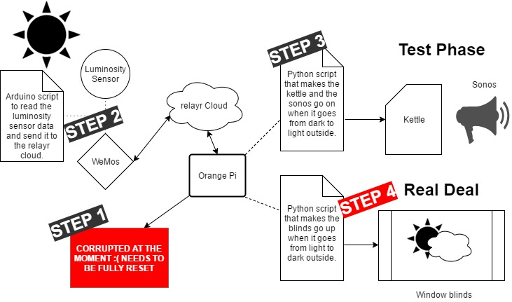
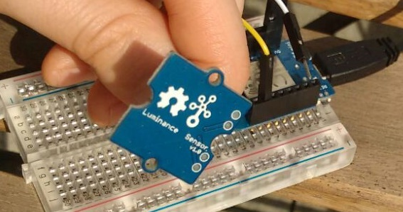
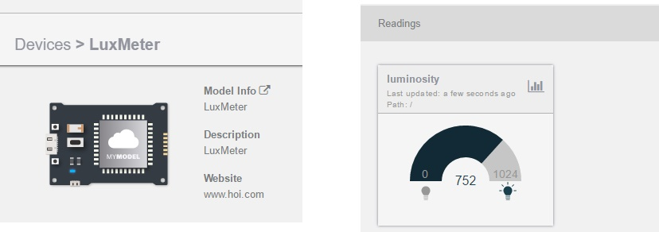
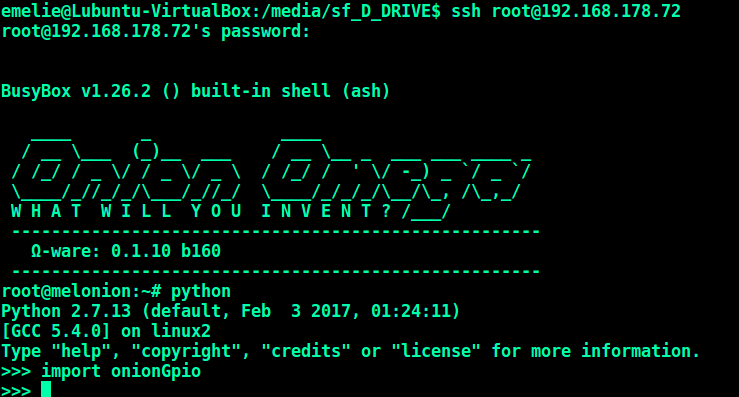
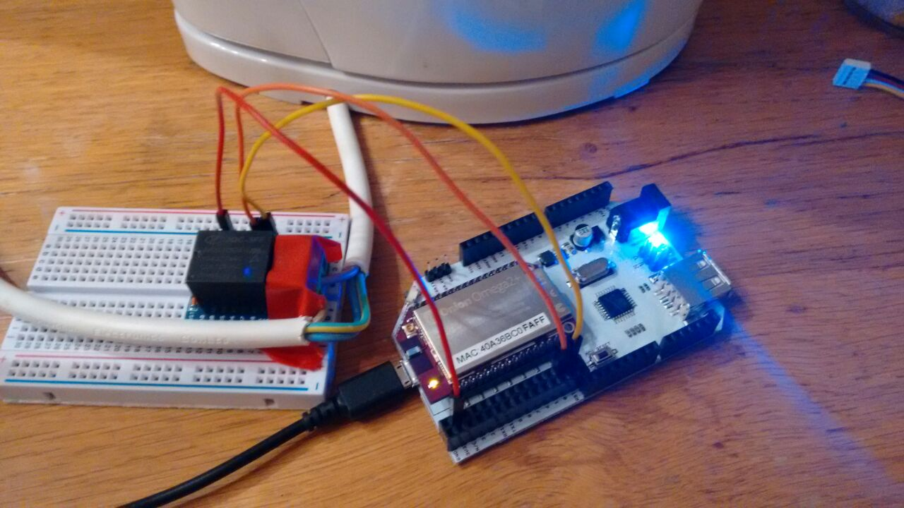
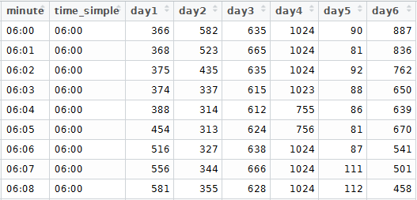
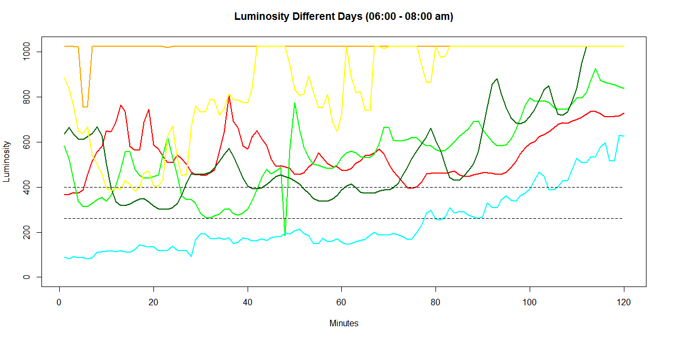
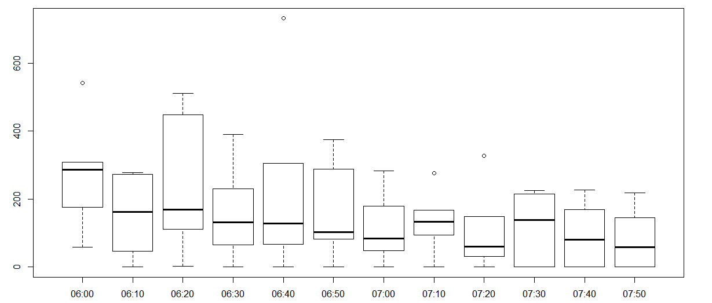

# The House of The Rising Blinds

Today we're finally getting started with our next SmartHome project on the list: **The Blind Hack**. My personal dream hack: install a luminosity sensor close to the living room window that communicates with a relay connected to the blinds in the bed room, to make the blinds go up automatically when the sun starts shining (or on a cloudy day in Berlin: it gets light outside).



## STEP 1: Resetting the OrangePi

_Unfortunately_, we were faced with a tiny bump in the road: we corrupted our OrangePi (probably by unplugging it unexpectedly). So the first step is a step back: setting up the OrangePi again.

To reset the OrangePi we reformatted the 32 GB mini SD card (which costed 3 euro - so no wonder it got corrupted a bit)  and burned the armbian image again to the card. We needed to do the usual setup again (change root password, set a user and a user password.) In the process we found out some commands that might be handy in the future:

* Discorvery #1: shutting down the OrangePi via SSH:

  ``sudo /sbin/shutdown -h now``

  After running this command we saw the OrangePi green light started flickering like crazy. At some point it stopped and the HDMI connected screen went off.  The light and the screen stayed off. The command seems to work well.


* The command we always need, but always forget to write down:

  ```ssh-keygen -R "192.168.178.64"```


* Before the big OrangePi we transferred our necessary files to Jaime's pc with scp:

  ```scp -r ~/welcome-home-sonos jaime@192.168.178.22:~/```

For the rest we followed the steps for installing NodeJS, NPM and the node-sonos-http-api that we documented in our [earlier repository](https://github.com/chronoclast/sensational-sonos-sensor-synchronization/tree/master/orange-pi-setup).

## STEP 2: Connect the Luminosity Sensor to the relayr Cloud

First of all: follow [this tutorial](https://github.com/relayr/ESP8266_Arduino/) to get your pc ready for Arduino action.

#### Sensor Basics:

VCC:	red = voltage (almost always 5v or 3.3v) (DC = CC)

GND/G:	black = ground

NC:		not connected (white cable = useless for almost all digital sensors)

SIG: 	the output of the sensor (signal)

**TIP FROM JAIME: Disconnect the power of the board before plugging the sensor!**

In the Arduino IDE, do not forget to set up the `Tools` > `Port` to the USB port that your board is connected too. 

Connect the luminosity sensor to the WeMos. We use an analog luminosity sensor (luminance sensor v1.0). The signal cable (in our case the yellow one) is connected to the **A0** pin on the WeMos:



To see the values from the luminosity sensor, you can flash the following Arduino code to the WeMos:

```C
#define LUMINOSITY_SENSOR_PIN A0  // choose the input pin (for PIR sensor)

void setup() {
  pinMode(LED_BUILTIN, OUTPUT);     // declare LED as output
  pinMode(LUMINOSITY_SENSOR_PIN, INPUT);     // declare sensor as input
  Serial.begin(9600);
}
 
void loop(){
  Serial.println(analogRead(LUMINOSITY_SENSOR_PIN));
  delay(1000);
}
```

To check the printed values, click on the _Serial Monitor_ in the Arduino IDE (little icon in the right upper corner).

The outside daylight - whether there is full sun or a cloud, gives us always the **maximum value: 1024**. Inside the house during the day we get a value of around 400/450.

Great! Our sensor is sending us the values we need. Now let's connect it to the relayr cloud. For this we need to set up a device in the cloud. A detailed description how to set up a device in the relayr cloud, you can find [here](https://github.com/Emelieh21/brand-new-kettle-hack/blob/master/setup_devices_relayr_cloud.md). Copy paste your credentials to the [luminosity_relayr_cloud.ino](D:\SundayFunday\luminosity_relayr_cloud.ino) file and flash it to the WeMos.

Now your device in the relayr cloud should start receiving values:



## STEP 3: Make the Light Sensor Interact with the Sonos & the kettle 

### 3.1 Connect the Sonos and the Luminosity Sensor

As described in [one of our earlier respositories](https://github.com/chronoclast/sensational-sonos-sensor-synchronization), we have a server running in the house that makes it possible to control the sonos via an API. In this next step we make the values of the luminosity sensor control the sonos. In this first simple script, we make the sonos stop playing every time it gets dark (luminosity < 50). If it gets light again (luminosity > 50), the sonos will start to play again.

For this script you will need the requests and the mqtt library for NodeJs. These steps are assuming you have NodeJS and npm installed on your pc.

```$ npm install request```

```$ npm install mqtt```

The only thing you need to do is put the credentials of your relayr device in the 03-welcome-home-sonos_sunshine.js script. Now you can run the script with:

```$ node 03-welcome-home_sunshine.js```

And play with your sonos by covering the light sensor and uncovering it.

Now you can make the script for example run on a raspberry or orange pi. **Tip**: in case you are running the script on seperate device like a orange pi, you can make it keep running even if you close the ssh terminal, with a npm package called [forever](https://github.com/foreverjs/forever).

you can install it with the following command:

```$ [sudo] npm install forever -g```

Go to the folder where you saved your script and type:

``$ forever start server.js``

In the script, I changed the value for the sonos to go on to 400 (average daylight value in our living room), which made the sonos start playing this moring at 8 AM. Quite correct time, however what if I would like it to start a little earlier - or not start at all? - without having to ssh the orange pi every time to change the values? Maybe Alexa can help out.

### 3.2 Make it Possible to Adjust the Script with Alexa

First we need a place where Alexa can send values to that the script can access. We can add another reading to the device we already created in the relayr cloud. Go to `Models` > `By me` > Click on your luminosity device > `EDIT` > Click on the `+` next to "Readings". set the meaning to "alexa" and the Value type to "integer".

The quick Alexa skill we just made consists of the [lambda_function](./alexa-files/lambda_function.py), [intent_schema](./alexa-files/intent_schema.json), [LIST_OF_ITEMS_ONE](./alexa-files/LIST_OF_ITEMS_ONE.txt) and the [sample_utterances](./alexa-files/sample_utterances.txt) that are added to this repository. It is a very simple skill that only accepts the commands **"early"/"zeitig"** (luminosity 260 - not sure yet how early this is), **"later"/"chill"** (luminosity 400 - around 8 AM this time of the year) and **"holiday"/"weekend"** (sonos should not start at all).

Now we need to make some adjustments to the 03-welcome-home-sonos_sunshine.js script to make it controlable. For this I had translate the 03-welcome-home_sunshine.js file to python (in order to deal with http and mqtt input). This translation plus the addition of the _alexaStatus_ you can find in the 03-welcome-home_sunshine.py file. 

To make python file run "forever" in the background, you can use forever as well:

```$ forever start -c python 03-welcome-home_sunshine.py```

Let's see tomorrow morning if the script worked.

### 3.3 Involve the kettle too!

I can tell you the script of last section worked - the sonos went on at luminosity 260 - which happened to be around **6:00 am** in the morning. We need to work on perfectionizing the triggers a bit still. We will come back to that later.

First, we continue with the next objective: involve the kettle too! We already hacked our kettle before - as explained in [this repository](https://github.com/Emelieh21/brand-new-kettle-hack). The end goal is to make the luminosity sensor interact with a relay that is connected to the blind switch. So it makes sense to reuse our kettle that we hacked with a relay already - to prepare the scripts for this.

This time instead of a Intel Edison board we use an **Onion Omega2** with an Arduino breakout board. The setup of this device is wonderfully documented on [the onion website](https://docs.onion.io/omega2-docs/get-started.html). 

Once you have setup your device and you are able to ssh it, we can prepare it for the script that we will be running to connect the relay. This is a python script - luckily, the Onion Omega2 comes with a light version of python preinstalled. We need to install the [onionGpio](https://docs.onion.io/omega2-docs/gpio-python-module.html) module for the connection with the relay.

SSH the onion:

```$ 
$ ssh root@<IP_OF_YOUR_ONION>
```

Once in the Onion, you can install the onionGpio module by:

```
$ opkg update
$ opkg install python-light pyOnionGpio
```

Now if you launch python and `import onionGpio` it should work.



For the ease of it - I installed `pip` as well, because I will need the `requests` module. Also, this is [well documented](https://docs.onion.io/omega2-docs/installing-and-using-python.html#using-pip-to-install-python-modules).

```
$ opkg install python-pip
$ pip install requests
```


For the interaction with the kettle we need another virtual device in the relayr cloud. In the last section we were sending values to an relayr device with Alexa - this will be a similar device, however it needs only one reading with a **boolean input**. We use the device we created already in the kettle hack. More info on that [here](https://github.com/Emelieh21/brand-new-kettle-hack/blob/master/setup_devices_relayr_cloud.md). 

The [kettle_switch_onion.py](kettle_switch_onion.py) script checks the value (_True_ or _False_) of a device in the relayr cloud (in our case the device is called "Kettle" and the meaning is "kettle"). When the meaning is set to true - it sends a 1 to the relay - which makes the kettle boil. Once you have your new device set up and the device id ready, you can push the python script to the device with scp (don't forget to adjust the token and the device id in the script!):

```
$ cd <folder_where_you_saved_the_py_script>
$ scp kettle_switch_onion.py root@<ip_of_your_onion>:~/
```



And then, if you ssh your onion again, you can keep this script running  in the background with:

 ```$ python kettle_switch_onion.py & ```

We still need to update the 03-welcome-home_sunshine.py script, to send a http post request to the kettle device on the relayr cloud whenever the luminosity hits the trigger value.

In the [03-welcome-home_sunshine_coffee.py](03-welcome-home_sunshine_coffee.py) script the request to the alexa device is added. I pushed it to the Orange Pi:

```$ scp 03-welcome-home_sunshine_coffee.py orange@192.168.178.64:~/PushToPi/WithPython ```

You can stop the forever process of the other welcome-home script with:

```$ forever stop 03-welcome-home_sunshine.py```

(check if it worked with `forever list`). And then run the new script with:

```$ forever start -c python 03-welcome-home_sunshine_coffee.py```

### 3.4 Explore the luminosity data in R to improve the trigger

Now if everything works out, our Sonos will start playing in the morning tomorrow and our kettle will start boiling our coffee water. **HOWEVER**, it would be nice to have a trigger value that makes a bit more sense. It turned out that 260 and 400 are not very reliable - since on a cloudy day the luminosity does not even go over 200 before 9:00 am and on a sunny day, 1024 is reached at 6:00 am. 

Luckily, we can download the values of our sensor from relayr via [services.relayr.io](https://services.relayr.io/batch/executions). You can download the data here as a csv file. The [csv](./assets/luminosity_readings.csv) with the values from my sensor are also included.

The question I am trying to answer here is: _what value/pattern occures everyday somewhere between 7:15  and 7:45 am - but not before?_ (because that is when eventually I would like the blinds to open, the coffee to start boiling and the Sonos to start playing). As you can see here in the data set with the luminosity values of the different days put next to each other, this is not going to be easy:





Working with the pure luminosity values, it looks almost impossible to make the Sonos/Kettle go on at a similar time. As a second exploration, I checked the increase in luminosity every 10 minutes between 06:00 - 08:00 am. This is diplayed in the boxplot below.  



I have decided it makes more sense to use a **time check** in the script that triggers the kettle and the Sonos (meaning: it goes on whenever it is 07:30 or 07:50 am - adjustable with Alexa). It seems more logical for this application. For raising the blinds however - it would still be cool to make it interact with the luminosity values. For now - you can find the new Python script that triggers the kettle and the Sonos at a set time in the morning in the [04-sonos-kettle-alarm.py](04-sonos-kettle-alarm.py) file.


------------ TO BE CONTINUED ------------

Up next: 

* ~~change the 03-welcome-home script to make http get request to the other device (alexa Kettle)~~ 

* ~~install chron to make the script run non-stop from startup~~ 

* ~~Replug the union and the kettle in the kitchen (don't want to keep that on my laptop)~~ 

* ~~change the trigger script for the sonos/kettle to start at a certain time instead of a certain luminosity, make the time settable by Alexa (OrangePi)~~ 

* Make the slackbot for the kettle run on the onion (~~Onion~~ not enough memory - maybe try OPi)

* Apply a relay to the blinds

* Adjust the previous script of the kettle/sonos to make it control the blinds instead (OrangePi) make it send a True to the cloud whenever the blind should go up

* research the change of luminosity values and come up with a plan to make the blinds go up smoothly

  ​
